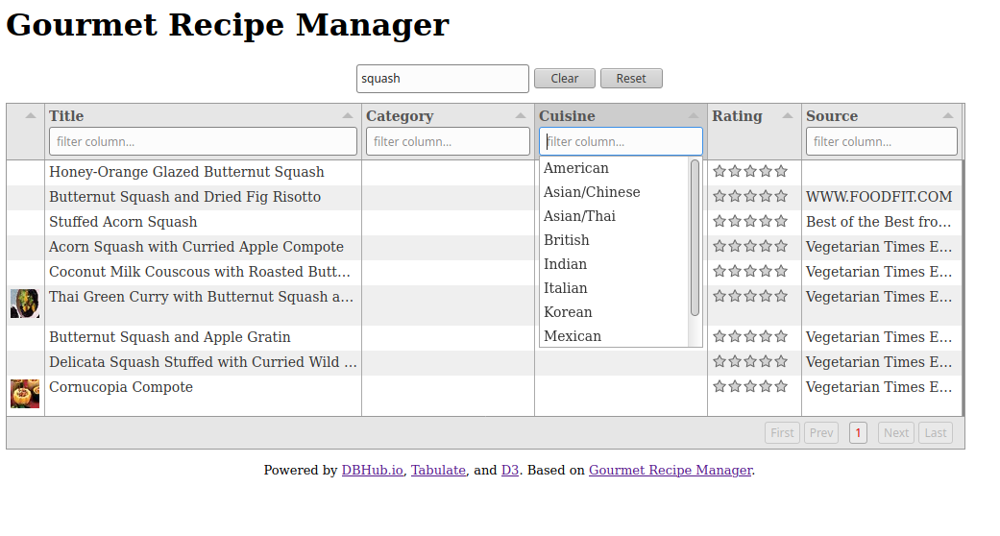
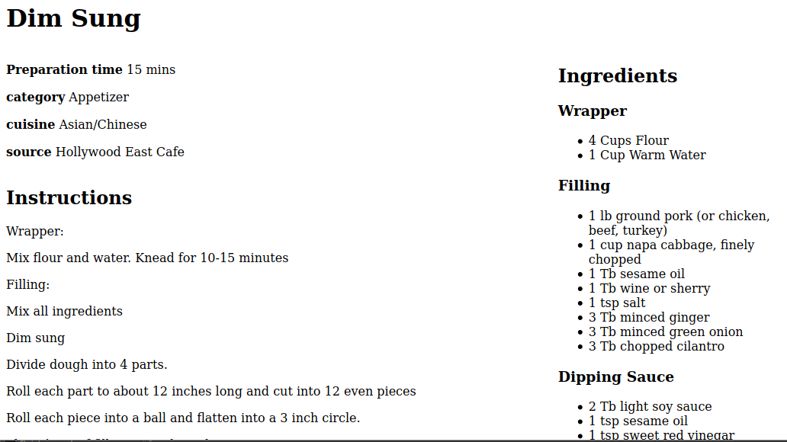

# My Gourmet Recipes

This project is a port of [Gourmet Recipe Manager](https://github.com/thinkle/gourmet/) to a Web app.  Note that the creator of Gourmet, Tom Hinkle is has his own [Web based version](https://www.gourmetrecipemanager.com/#).

This version is based on:

* [DBHub.io](https://dbhub.io/)
* [Tabulate](http://tabulator.info/)
* [D3](https://d3js.org/)  (See also my [Introduction to D3](https://github.com/JamesPerreault/D3-Introduction).)

## Screenshots

The main screen:

Recipe screen:

